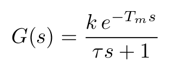
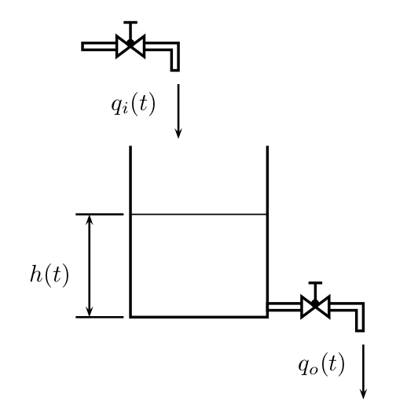
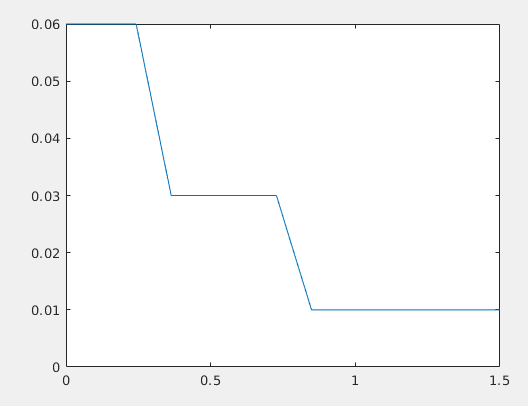

# Design of automatisms

Design and simulate a control system based on automations
(Boolean algebra) that allows to regulate the filling of the
tank of figure 1. The inflow should be considered
total as qi = Y1q1 + Y2q2 + Y3q3, where (Y1, Y2, Y3)
are the respective activation functions. For the control
system is equipped with four sensors which must be
Properly dispose throughout the tank. The system
can be considered first-rate with a downtime
with the following transfer function:

<p align="center">
    
</p>

Image model
<p align="center">
    
</p>


Proposed solution
================


### Results

<p align="center">
    
</p>

### Code

```matlab
%{
    Name: Daniel Santos
    Desc: Solution task 1.1
%}

clc; clear all; close all; format compact;

% boundaries levels water testing
N = 100; from = 0; to= 12;

% rates of filling of the taps
t1 = 0.01; t2 = 0.02; t3 = 0.03;

%Creating the sample
levelsWater = linspace(from,to, N);
for i =  1:N
  rateFill(i) = booleanControl( levelsWater(i), t1, t2 , t3);
end

%Unit Testing
plot( levelsWater, rateFill);
axis([0,1.5, 0, t1+t2+t3])

```
